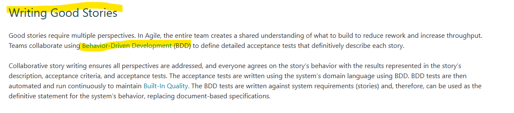
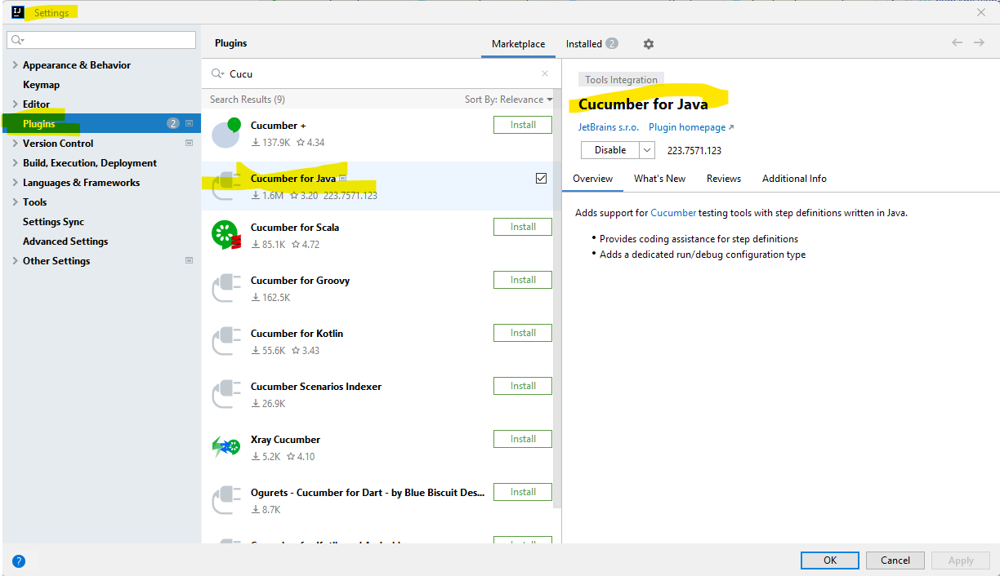
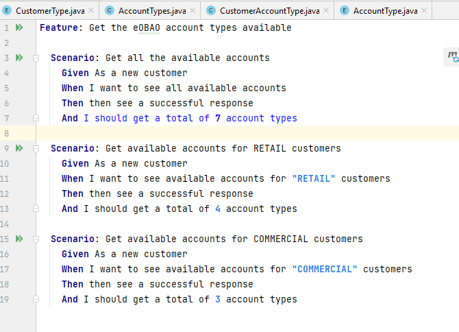

# eobao-app-bdd

### BDD Example Mapping
https://cucumber.io/blog/bdd/example-mapping-introduction/

### SAFe and BDD
https://scaledagileframework.com/story

### Install Cucumber plugin in IntelliJ

### A simple REST based spring boot app
Has 2 REST end points
#### Get all the account types

#### Get all the account types for a customer type

#### The Acceptance criteria is written in Gherkin - a human readable format

